# Bot Manager Flow Diagram

This diagram specifically reflects the logic within `processIncomingMessage` in `lib/conversation-engine/bot-manager.ts`.

```mermaid
graph TD
    A["processIncomingMessage_Start(userMessage, currentUser)"] --> B["Get_or_Create_ChatContext"];
    B --> C["Ensure_Active_ChatSession"];
    C --> D{"Find_Active_InProgress_UserGoal_in_Session?"};

    D -- No --> E["Call_LLM_detectUserIntention"];
    E --> F{"LLM_Detected_New_Goal?"};
    F -- Yes --> G["Create_New_UserGoal_Object"];
    G --> H["Add_New_Goal_to_Session_activeGoals"];
    H --> I["Set_userCurrentGoal_to_New_Goal"];
    F -- No --> J["Call_LLM_generate_CannotUnderstand_Response"];
    J --> K["Update_Session_LastMessage"];
    K --> Z["Return_Response_No_Goal"];
    
    D -- Yes --> L["Set_userCurrentGoal_to_Existing_Active_Goal"];
    L --> M;
    I --> M;

    M["Initialize_FlowNavigator_for_userCurrentGoal"] --> N["Get_currentStepHandler_from_Navigator"];
    N --> O{"currentStepHandler_Exists?"};

    O -- Yes --> P["Add_UserMessage_to_Goal_History"];
    P --> Q["Call_currentStepHandler_validateUserInput_&#40;can_use_LLM&#41;"];
    Q --> R{"Input_Valid?"};

    R -- Yes --> S["Call_currentStepHandler_processAndExtractData_&#40;can_use_LLM&#41;"];
    S --> T["Update_userCurrentGoal_collectedData"];
    T --> U["Increment_userCurrentGoal_currentStepIndex"];
    U --> V{"Flow_Completed_via_Navigator?"};
    V -- Yes --> W["Set_userCurrentGoal_status_to_completed"];
    W --> X_Success;
    V -- No --> X_Success;
    X_Success["Call_LLM_generateChatbotResponse_for_Success"];
    X_Success --> Y_Success["Determine_fixedUiButtons_for_Next_Step_if_any"];
    Y_Success --> STORE_RESPONSE["Store_LLM_Response_Text_and_Buttons"];

    R -- No --> X_Fail["Call_LLM_generateChatbotResponse_for_Failure_&#40;Validation&#41;"];
    X_Fail --> Y_Fail["Set_fixedUiButtons_to_Current_Step_Handler_Buttons"];
    Y_Fail --> STORE_RESPONSE;

    O -- No --> AA["Handle_No_StepHandler_Found"];
    AA --> AB{"userCurrentGoal_status_is_completed?"};
    AB -- No --> AC["Set_userCurrentGoal_status_to_failed"];
    AC --> AD["Set_Error_Response_Text_System_Error"];
    AD --> STORE_RESPONSE_NO_HANDLER_FAIL;
    AB -- Yes --> AE["Set_Goal_Completed_Response_Text"];
    AE --> STORE_RESPONSE_NO_HANDLER_SUCCESS;

    STORE_RESPONSE --> BB["Add_Chatbot_Response_to_Goal_History"];
    STORE_RESPONSE_NO_HANDLER_FAIL --> BB;
    STORE_RESPONSE_NO_HANDLER_SUCCESS --> BB;
    BB --> CC["Update_Session_LastMessage_and_ActiveGoals"];
    CC --> Z["Return_Final_Response_and_Buttons"];

    classDef llm fill:#f9d,stroke:#333,stroke-width:2px
    class E,J,Q,S,X_Success,X_Fail llm

    classDef decision fill:#lightblue,stroke:#333,stroke-width:2px
    class D,F,O,R,V,AB decision

    classDef important_step fill:#e6ffe6,stroke:#333,stroke-width:1px
    class G,H,I,L,M,P,T,U,W,Y_Success,Y_Fail,AA,AC,AD,AE,BB,CC important_step
```

## Diagram Explanation:

*   **Nodes (`NodeId["Label_Text"]`)**: Actions, decisions, or LLM calls within `processIncomingMessage`. Labels are quoted and use underscores.
*   **LLM Calls (Pink)**: Indicate direct interactions with the `callLLMForTask` function.
*   **Decisions (Light Blue)**: Diamond shapes representing conditional logic.
*   **Important Steps (Light Green)**: Rectangular boxes for key processing actions or state changes.

This diagram illustrates the control flow of `bot-manager.ts` for handling a user message. 