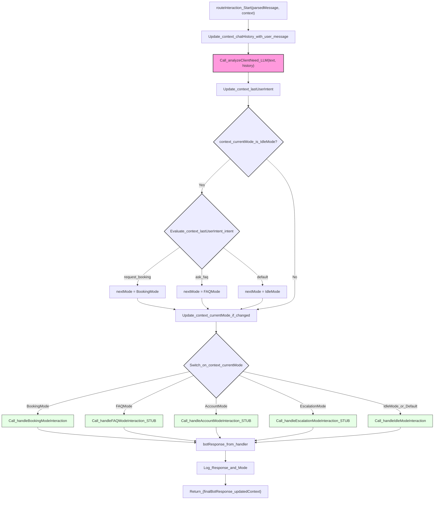

# Main Conversation Manager Flow

This diagram specifically reflects the logic within `routeInteraction` in `lib/conversation-engine/main-conversation-manager.ts`.

## Diagram Explanation:

*   **Nodes (`NodeId["Label_Text"]`)**: Represent actions, decisions, or function calls within `routeInteraction`. Labels are quoted and use underscores for spaces to ensure rendering compatibility.
*   **`routeInteraction_Start`**: Entry point of the function.
*   **`Call_analyzeClientNeed_LLM`**: Represents the LLM call to determine user intent. (Highlighted in pink)
*   **Decisions (Blue菱形)**:
    *   `context_currentMode_is_IdleMode?`: Checks if the conversation is currently in `IdleMode`.
    *   `Evaluate_context_lastUserIntent_intent`: If in `IdleMode`, this checks the detected intent to decide on a mode transition.
    *   `Switch_on_context_currentMode`: The main `switch` statement that delegates to different mode handlers.
*   **Mode Handlers (Greenish boxes)**: Represent calls to specific functions like `handleBookingModeInteraction`, `handleFAQModeInteraction`, etc.
*   **`Return_{finalBotResponse_updatedContext}`**: The final output of the `routeInteraction` function.

This diagram focuses on the control flow and key decision points within your `main-conversation-manager.ts` file. 